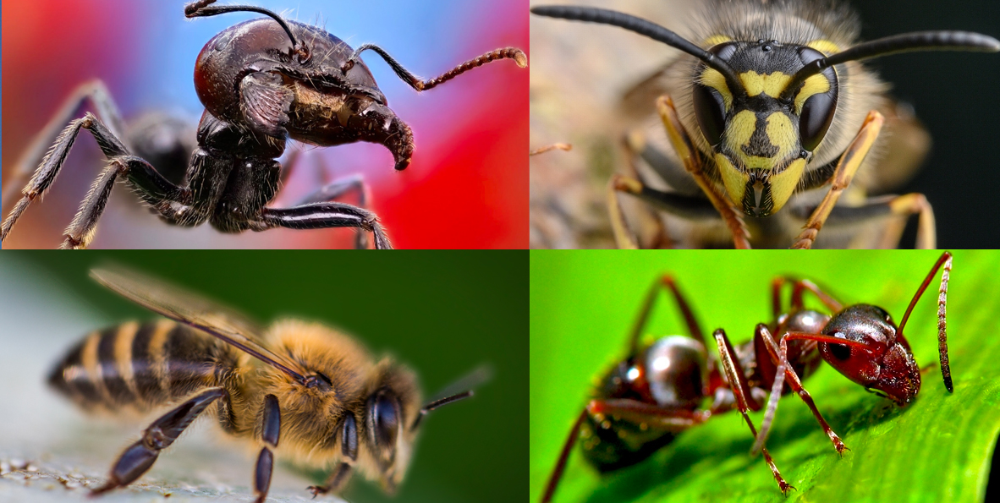
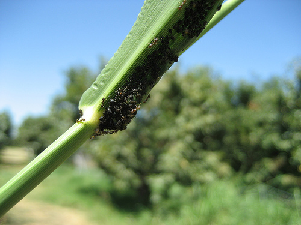
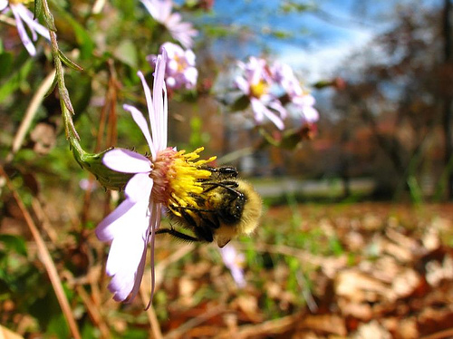

# Hymenoptera-DINO-cls

##### Григорян Владислав Артурович
## Постановка задачи
1. Разработать модель для классификации изображений из датасета Hymenoptera на классы муравьев и пчел
2. Развернуть страницу Streamlit для пользования моделью
### Формат входных и выходных данных
На вход поступают RGB изображения в разрешении $256 \times 256$, которое принято использовать при работе с *DINOv3*.
На выходе модель выдает один логит для класса “пчела”.
### Метрики
В качестве метрик используются *accuracy, precision, recall, F1* и *ROC-AUC* – этот набор метрик хорошо известен и прост в интрепретации при сбалансированном датасете.

Бейзлайном, с которым я буду сравнивать свое решение будет самый популярный ноутбук для этого датасета на Kaggle от пользователя [Janmey](https://www.kaggle.com/code/naastalover/ants-and-bees). В этой была достигнута точность 0.95 на val части датасета. Для решения автор обучил классифицирующую голову над фичами, полуенными из замороженного ResNet18. При этом к данным были применены следующие трансформации:
+ На этапе train: `T.RandomResizedCrop(224), T.RandomHorizontalFlip(), ToTensor(), T.Normalize([0.485, 0.456, 0.406], [0.229, 0.224, 0.225]`
+ На этапе test: `T.Resize(256), T.CenterCrop(224), T.ToTensor(), T.Normalize([0.485, 0.456, 0.406], [0.229, 0.224, 0.225]`
В своем решении я рассчитываю получить сопоставимую точность при использовании более современной архитектуры в качестве feature extractor.
### Валидация и тест
Датасет Hymenoptera разделен train и val выборки. Я буду использовать val-выборку в качестве test, а путем hold out извлеку 50 изображений с одинаковым распределением обоих классов из исходного train для формирования валидационной выборки.
### Датасеты
Я воспользуюсь датасетом [Hymenoptera](https://www.kaggle.com/datasets/thedatasith/hymenoptera/data), опубликованным 
[Francisco Zabala](https://www.kaggle.com/thedatasith) в 2022 году на платформе Kaggle.
Этот датасет создавался для задачи классификации цветных изображений насекомых на муравьев и пчел.

Примеры данных:
+ Класс 0, муравей

+ Класс 1, пчела

В исходном датасете разрешения изображений варьируются в следующих диапазонах:
+ train
	+ 0 (*ants*)
		+ Минимальное разрешение: 193x130 px
		+ Максимальное разрешение: 1488x1984 px
	+ 1 (*bees*)
		+ Минимальное разрешение: 311x173 px
		+ Максимальное разрешение: 500x500 px
+ val
	+ 0
		+ Минимальное разрешение: 333x199 px
		+ Максимальное разрешение: 2592x1944 px
	+ 1
		+ Минимальное разрешение: 328x272 px
		+ Максимальное разрешение: 800x533 px

При изначальном разбиении датасета на train и val распределение классов в этих выборках выглядело так:
+ train
	+ 0: 124
	+ 1: 121
+ val
	+ 0: 70
	+ 1: 83

После разбиения исходного датасета на train, val и test по схеме  hold out, распределение классов в выборках стало следующим:
+ train
	+ 0: 99
	+ 1: 96
+ val
	+ 0: 25
	+ 1: 25
+ test
	+ 0: 70
	+ 1: 83

Общий размер датасета составляет 48МБ.

К особенностям этого датасета, осложняющим задачу классификации можно отнести то, что классифицируемые насекомые порой занимают очень небольшую часть изображения, и также то, что порой, кроме муравьев и пчел на изображениях могут присутствовать другие виды насекомых.
## Моделирование
### Бейзлайн
Бейзлайном, с которым я сравню свое решение, будет самый популярный ноутбук для этого датасета на Kaggle от пользователя [Janmey](https://www.kaggle.com/code/naastalover/ants-and-bees). В нем задача решается моделью из замороженного featre extractor ResNet18 и обучаемой головы для бинарной классфикации.
Схожие результаты демонстрирует другая модель аналогичной архитектуры, представленная в статье [Comparative Analysis of ResNet Models for Hymenoptera
Detection in Ants and Bees Images](https://mail.joiv.org/index.php/joiv/article/viewFile/4901/1648)  от Ashraf et al., которая получила схожее значение метрики: $accuracy=0.94$ и $AUROC=0.96$.
### Основная модель
Я обучил классифицирующиую голову поверх backbone feature extractor [vit_base_patch16_dinov3.lvd1689m](https://huggingface.co/timm/vit_base_patch16_dinov3.lvd1689m). Веса feature extractor заморожены, обучается только классифицирующий линейный слой. На вход в линейный слой из feature extractor подается конкатенация векторов \[CLS\], среднего значения и покоординатного максимума патчей.

Передаче изображения в модель предшествует предобработка: для train, val и test это приведение размера к $256\times 256$ (стандарт для DINOv3) и нормализация по каналам (с стандартным распределением для CV); в преобразования для train также включены аугментации из torchvision `RandomHorizontalFlip, RandomRotation, ColorJitter, RandomGrayscale, GaussianBlur` с параметрами, указанными в конфигурации hydra.

Модель описана и обучена с помощью фреймворка PyTorch Lightning, гиперпараметры хранится в hydra, результаты экспериментов фиксируются в MLFlow, зависимости проекта обслуживаются через пакетный менеджер uv.
## Внедрение
Обученная модель экспортируется в ONNX и TensorRT (при наличии GPU). ONNX версия разворачивается для inference при помощи MLFlow Serving на CPU *AMD Ryzen 7 7730U with Radeon Graphics (16) @ 4.546GHz*. Интерфейс модели реализован с помощью фреймворка Streamlit: через GUI загружается изображение и передается в модель для предсказания класса - после этого пользователь получает предсказание и его вероятность.

## Setup
`uv sync` - install all the dependencies.

## Train
`uv run src/train.py` - strat training process with the parameters given in the hydra config sections *dataset* and *model*.

## MLFlow serving
`uv run src/scripts/run_server` - run MLFlow Serving endpoints at the host and port definded in the hydra config section *tracking*. By default the host is **127.0.0.1** and the port is **8080**.

## GUI inference
`uv run streamlit run src/scripts/run_gui.py` - run streamlit GUI for manual access to the inference endpoint. By default GUI runs on host **127.0.0.1** and port **8501** - check your console output for the actual URL.

